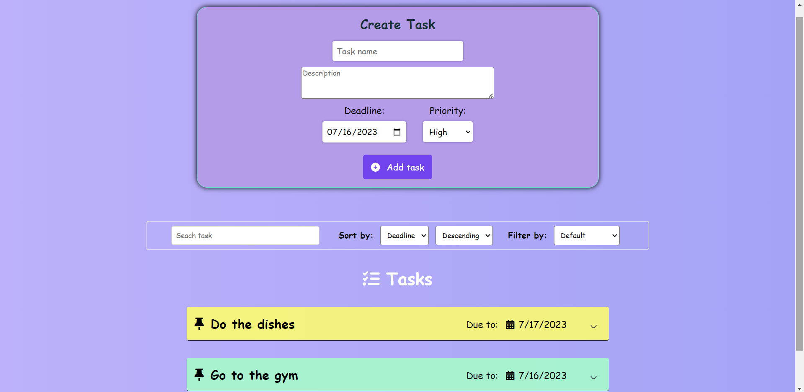
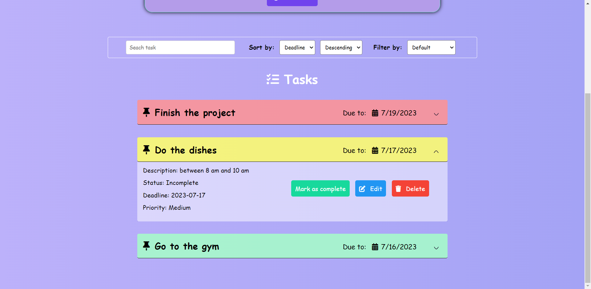
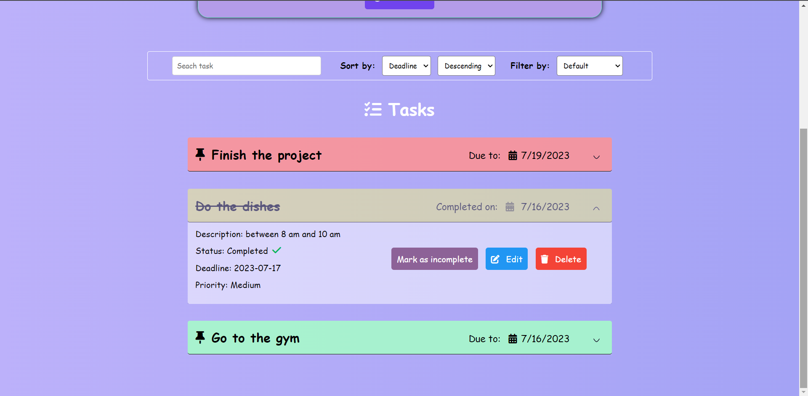

# To-Do-App

This is a To-Do App.

You can:
- add a to-do to the list
- choose priority - Red, Medium, Green
- search by name
- sort by priority / deadline - Ascending / Descending
- filter by status - completed or not
- filter by priority
- edit name, description, change deadline
- delete a to-do

# 💻Technologies

 - Vanilla Javascript
 - HTML
 - CSS

# 👀Screenshots

</img>
</img>
</img>

# 🏆Feedback 

Thank you for viewing my project. If you have any questions, just dm me.